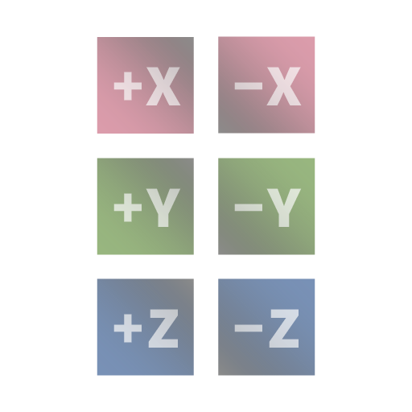
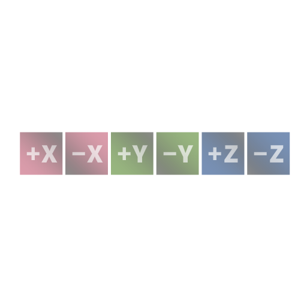
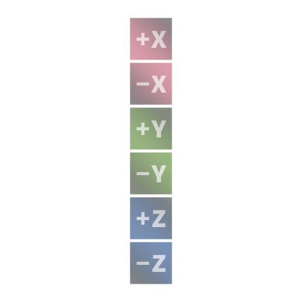
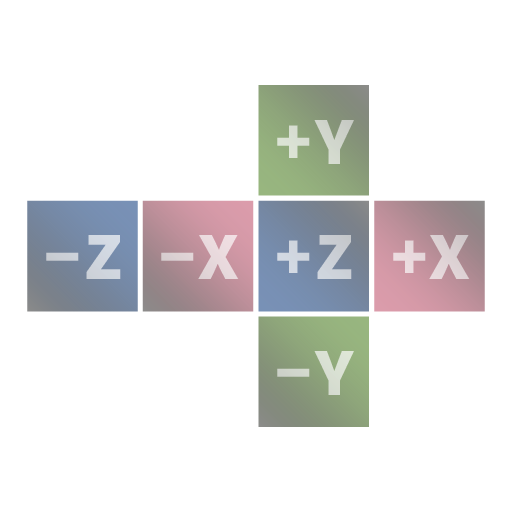
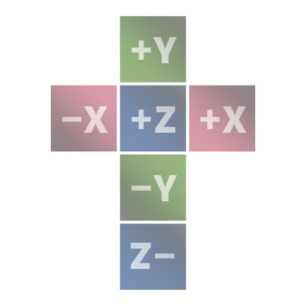
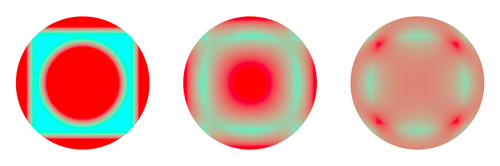
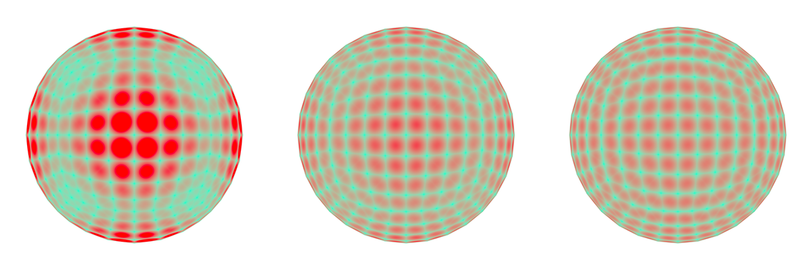

# kubi

**kubi** is a fast and flexible cubemap generator based on [libvips](https://libvips.github.io/libvips/)

## Install

``` shell
pip install git+https://github.com/indus/kubi.git
```
### Requirements
- [numpy](https://numpy.org/)
- [pyvips](https://libvips.github.io/pyvips/) (bindings for libvips)

## Description

**kubi** can convert equirectangular images into a variety of common [layouts](#layouts). All image formats supported by vips (JPEG, PNG, TIFF, WEBP, HEIF, ...) can be used for input and output. With the [DZ format](https://libvips.github.io/libvips/API/current/Making-image-pyramids.md.html) of libvips it is even possible to [create tiled images](#tiled-cubemaps) of the cubefaces.   
When used with a glob pattern for multiple input files, **kubi** generates an [index file](https://libvips.github.io/libvips/API/current/libvips-resample.html#vips-mapim) once and reuses it while processing all found images. This can lead to a [significant speedup](#multiple-input-files). 

## Usage
### all options
``` shell
kubi -h
```

### basic usage
``` shell
kubi [-s <size>] [-l {row,column,crossL,crossR,crossH}] srcfile [dstfile]
```

#### Layouts

| none   | row    | column |
| :---:  | :---:  | :---:  |
|  |  |  |

|  |  |  |
| :---:  | :---:  | :---:  |
| crossL | crossR | crossH |

### tiled cubemaps
``` shell
kubi -s 2048 -co tile_size=512 -co depth=onetile -co overlap=0 -co layout=google -co suffix=.jpg[Q=75] -n l r u d f b srcfile dstfile.dz
```
| argument | explanation |
| :--- | :--- |
| ```-s 2048```              | every cubeface has an overall size of 2048px |
| ```-co tile_size=512```    | every cubeface gets split into tiles with a size of 512px (≙ 3 levels) |
| ```-co depth=onetile```    | stop tiling with onetile (vips default is one pixel!) |
| ```-co overlap=0```        | tiles should have an overlap of 0px (vips default is one pixel!) |
| ```-co layout=google```    | use the google folder/file layout (options are ```dz```, ```zoomify```, ```google```, ```iiif```) |
| ```-co suffix=.jpg[Q=75]```| tiles should be JPEG with a quality of 75 |
| ```-f r l u d f b```       | defined suffixes r(ight), l(eft), u(p), ... |
| ```srcfile```              | the input file; could be a glob pattern |
| ```dstfile.dz```           | the output folder name; use ```.dz``` extension for tiles |

With some fiddling the file and folder structure could be made compatiple to 360° image viewers.   
The above would work with [Marzipano](https://www.marzipano.net/):
``` JS
Marzipano.ImageUrlSource.fromString("<some_path>/dstfile_{f}/{z}/{y}/{x}.jpg");
```

## Benchmark

***system:*** CPU: i7-6700 CPU @ 3.40GHz, 4 cores; MEM: 64GB; OS: Win 10  

### single input file   
***input:*** equirectangular image with 4096x2048px   
***output:*** cubemap with a cross layout

| face size | 1024px | 2048px | 4096px |
| ---| --- | --- | --- |
| kubi                                                   | 0.9s | 1.7s | 4.9s  |
| [py360convert](https://pypi.org/project/py360convert/) | 2.5s | 8.7s | 33.0s |
| *any others ?* | - | - | - |

### single input file - tiled output 
***input:*** equirectangular image with 4096x2048px   
***output:*** cubemap as seperate tiles

| face size | 1024px | 2048px | 4096px |
| ---| --- | --- | --- |
| kubi                                                   | 0.9s | 1.4s | 3.5s  |
| [panorama_windows.exe](https://github.com/blackironj/panorama) | 1.4s | 4.4s | 16.8s |
| *any others ?* | - | - | - |

### multiple input files
If only a few cubemaps are needed, performance is probably of minor concern. But with **kubi** it should also be possible to process thousands of animation frames in a reasonable time:

***input:*** multiple equirectangular images with 4096x2048px   
***output:*** multiple cubemaps with a cross layout and a face size of 2048px
| count | total time | time per cubemap |
| :---: | :---: | :---: |
| 1  | 1.7s  | 1.7s |
| 2  | 2.6s  | 1.3s |
| 3  | 3.5s  | 1.2s |
| 5  | 5.2s  | 1.0s |
| 10 | 9.9s  | 1.0s |
| 20 | 18.5s | 0.9s |

# Transforms
In addition to regular cubemaps, two optimized mappings can be generated:
- **Equi-Angular Cubemap (EAC)**   
C.Brown (2017): [Bringing pixels front and center in VR video](https://blog.google/products/google-ar-vr/bringing-pixels-front-and-center-vr-video/) 
- **Optimized Tangens Cubemap (OTC)**   
M.Zucker & Y.Higashi (2018): [Cube-to-sphere Projections for Procedural Texturing and Beyond](http://jcgt.org/published/0007/02/01/paper.pdf) (Ch. 3.2 & Ch. 5)  

Both transforms significantly reduce the distortion of the cubemap and thus optimize the pixel yield. However, support in other tools and libraries is rather scarce.

| deviation  | ltr: regular cubemap, EAC, OTC  |
| :---:  | :---:  |
| area |  
| distance |  